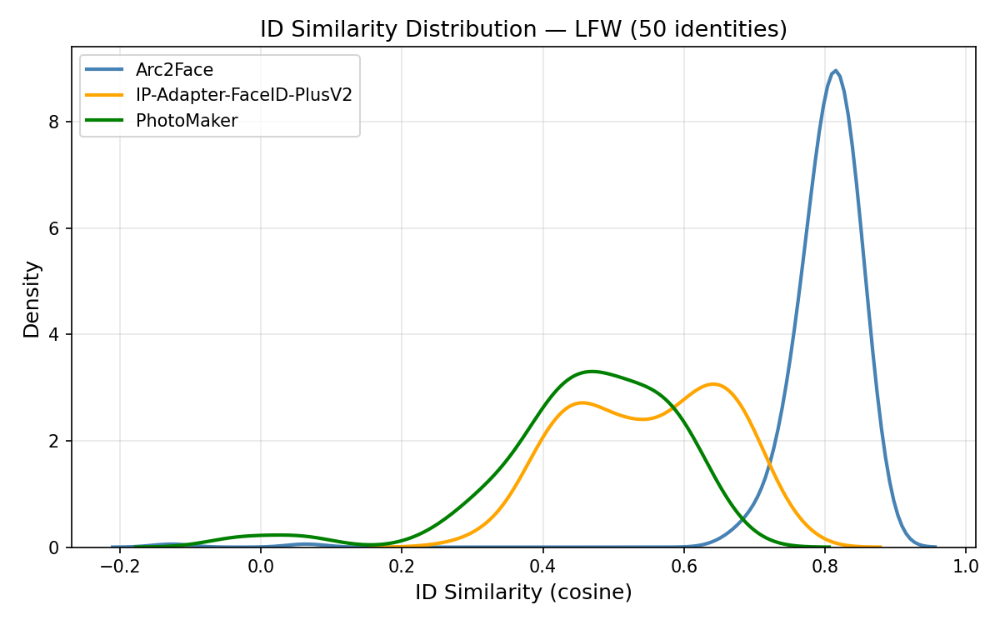

# Arc2Face Reproduction on LFW
 
Reproduction and evaluation of *Arc2Face: A Foundation Model for ID-Consistent Human Faces*
(Paraperas Papantoniou et al., ECCV 2024), developed for the Image Processing course at the
*Federal University of Maranhão (UFMA)*, Center for Exact Sciences and Technology (CCET).
 
We replace the paper's original evaluation sets (Synth-500 and AgeDB) with the public **LFW
(Labeled Faces in the Wild)** dataset, and compare Arc2Face against two baselines that the
original authors also compare against: *IP-Adapter-FaceID-PlusV2* and *PhotoMaker*.
 
*Authors:* Louise Reis Mendes, Raianny Cristina Ferreira da Silva, Yasmin Cantanhede Santos,
Haroldo Barroso Gomes Filho (advisor)
 
---
 
## Paper
 
The full paper is available in both English and Portuguese in the [paper/](./paper) folder.
 
- *Overleaf (English, read-only):* https://www.overleaf.com/read/dnkgcsywvqyt#111484
- *Overleaf (Portuguese, read-only):* https://www.overleaf.com/read/csgsxbyfmkzj#b3b0c7
---
 
## Overview
 
Arc2Face conditions a Stable Diffusion v1.5 backbone *only* on an ArcFace identity embedding
(no textual description of the person), which gives it strong identity preservation. This
project reproduces that behaviour and quantifies it against two text+identity baselines using
the same three metrics reported in the paper: *ID Similarity, **LPIPS, and **FID*.
 
| Model | Role | Conditioning |
|-------|------|--------------|
| Arc2Face | Main model | ArcFace embedding only |
| IP-Adapter-FaceID-PlusV2 | Baseline 1 | ArcFace embedding + CLIP facial structure |
| PhotoMaker | Baseline 2 | Stacked ID image embeddings |
 
---
 
## Repository structure
 

arc2face-reproduction-lfw/
├── README.md
├── notebooks/
│   ├── 01_arc2face_main.ipynb            # Main model — RUN FIRST
│   ├── 02_ipadapter_faceid_plusv2.ipynb  # Baseline 1
│   ├── 03_photomaker.ipynb               # Baseline 2
│   └── 04_evaluation.ipynb               # Metrics: ID Sim, LPIPS, FID
├── paper/
│   ├── arc2face_en.pdf                   # Paper (English)
│   ├── arc2face_pt.pdf                   # Paper (Portuguese)
│   └── overleaf_link.txt                 # Overleaf project link
└── results/
    ├── evaluation_table.csv
    ├── pipeline_diagram.png              # Arc2Face generation pipeline
    ├── evaluation_pipeline.png           # Evaluation/metrics pipeline
    ├── arc2face_samples.png              # Arc2Face generations (3 identities)
    ├── jessica_alba_comparison.png       # Same-subject comparison (3 models)
    ├── id_similarity_distribution.png
    └── visual_comparison.png

 
---
 
## Requirements
 
All notebooks are designed to run on *Google Colab* with a GPU runtime
(A100 recommended; T4 works for Arc2Face). No local setup is required — each notebook installs
its own pinned dependencies.
 
Key pinned versions (installed automatically inside the notebooks):
 
- diffusers==0.29.2
- transformers==4.36.0
- peft==0.9.0
- insightface + onnxruntime-gpu
A Google Drive account is required to persist results between notebooks
(all outputs are written under MyDrive/Arc2Face/).
 
---
 
## How to reproduce (step by step)
 
> *Execution order matters.* Notebook 01 selects and freezes the 50 evaluation identities and
> writes arc2face_processed.json to Google Drive. The baseline notebooks (02, 03) read that
> exact list so that all models are evaluated on identical inputs. Always run 01 first.
 
### Step 1 — Arc2Face (main model)
 
1. Open notebooks/01_arc2face_main.ipynb in Google Colab.
2. Set the runtime to GPU (Runtime → Change runtime type → GPU).
3. Run all cells top to bottom.
This downloads the LFW dataset, samples 50 identities (fixed seed = 42), generates 5 images per
identity, and saves both the images and arc2face_processed.json to
MyDrive/Arc2Face/results_arc2face/.
 
### Step 2 — IP-Adapter-FaceID-PlusV2 (baseline 1)
 
1. Open notebooks/02_ipadapter_faceid_plusv2.ipynb in Colab (GPU runtime).
2. Run all cells.
Reads the same 20 identities and generates 5 images each, saved to
MyDrive/Arc2Face/results_ipadapter_faceid/.
 
> *Important detail:* the IP-Adapter-FaceID models were trained with identity embeddings from
> the InsightFace *buffalo_l* recognition model. The notebook uses buffalo_l for
> extraction — using a different backbone (e.g. antelopev2) places the embedding in an
> incompatible vector space and produces unrelated faces.
 
### Step 3 — PhotoMaker (baseline 2)
 
1. Open notebooks/03_photomaker.ipynb in Colab (GPU runtime).
2. Run all cells.
Reads the same 20 identities and generates 5 images each, saved to
MyDrive/Arc2Face/results_photomaker/.
 
### Step 4 — Evaluation
 
1. Open notebooks/04_evaluation.ipynb in Colab (GPU runtime).
2. Run all cells.
Computes ID Similarity, LPIPS and FID for all three models and produces the comparison table,
the ID-similarity distribution plot, and the visual comparison grid.
 
---
 
## Dataset
 
- *LFW (Labeled Faces in the Wild)* — 13,233 images of 5,749 identities collected in
  unconstrained conditions.
- We keep identities with ≥ 2 images and sample *50* with a fixed seed (42).
- *5 images generated per identity per model* → 250 samples per model.
The 50-identity subset is a compute-budget choice for a Colab session; it is large enough to
produce a stable distribution of the evaluation metrics. FID, which compares distributions and
benefits from larger sample sizes, is reported as an indicative value.
 
---
 
## Evaluation metrics
 
| Metric | Meaning | Better |
|--------|---------|--------|
| *ID Similarity* | Cosine similarity between the ArcFace embeddings of the input and the generated images | Higher |
| *LPIPS* | Pairwise perceptual distance between images of the same identity (diversity) | Higher |
| *FID* | Fréchet Inception Distance between real and generated image distributions (quality) | Lower |
 
---
 
## Results
 
<!-- TODO: fill in with the final numbers from 04_evaluation.ipynb -->
 
| Method | ID Sim ↑ | LPIPS ↑ | FID ↓ |
|--------|----------|---------|-------|
| Arc2Face (main) | TBD | TBD | TBD |
| IP-Adapter-FaceID-PlusV2 | TBD | TBD | TBD |
| PhotoMaker | TBD | TBD | TBD |
 

 
---
 
## Paper
 
- English version: [paper/arc2face_en.pdf](paper/arc2face_en.pdf)
- Portuguese version: [paper/arc2face_pt.pdf](paper/arc2face_pt.pdf)
- Overleaf project: see [paper/overleaf_link.txt](paper/overleaf_link.txt)
---
 
## References
 
- F. Paraperas Papantoniou et al., "Arc2Face: A Foundation Model for ID-Consistent Human
  Faces," ECCV 2024.
- J. Deng et al., "ArcFace: Additive Angular Margin Loss for Deep Face Recognition," CVPR 2019.
- Q. Wang et al., "InstantID / IP-Adapter-FaceID," 2024.
- Z. Li et al., "PhotoMaker: Customizing Realistic Human Photos via Stacked ID Embedding,"
  2023.
- G. B. Huang et al., "Labeled Faces in the Wild," Technical Report, 2008.
---
 
## Acknowledgements
 
We thank the authors of Arc2Face, IP-Adapter, and PhotoMaker for releasing their code and
model weights, and Google Colab for the compute used in these experiments.
